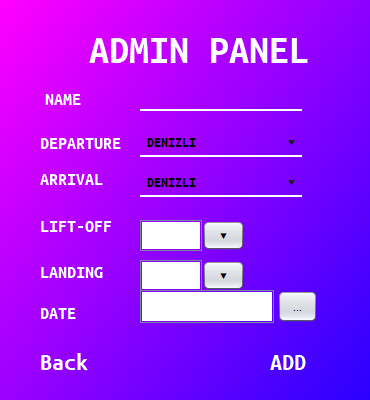

# Hava Yolu Projesi
___
  - **Proje hakkında bilgi:**
    - 

  - *Kullanıcı ilk önce karşılama ekranı ile karşılanmaktadır. Bu ekranda **LOGIN**, **REGISTER** ve **EXIT** buttonları bulunmaktadır.*

    - 

    - 

  - *Kullanıcı hesabı var ise **LOGIN** buttona tıklayarak giriş ekranına geçer.Yok ise REGISTER ekranına geçerek kayıt olur.*

  - *Giriş ekranında E-mail ve Password alanlarını doldurur ve **LOGIN** tusuna basar ve giriş yapar.*

    - 

  - *Giriş yaptıktan sonra User Interface ekranına gelir ve burada **BUT TICKET**, **MY TICKETS**, **LOG OUT** ve **EXIT** buttonları bulunmaktadır.*

    - 

  - ***BUY TICKET** buttonuna tıklayarak bilet alma ekranına geçiş yapar ve bu ekranda nerden, nereye, hangi tarihte gidip, hangi tarihte döneceğini(gidiş dönüş ise), kaç bilet alacağını ve gidiş dönüş mü yoksa tek gidiş mi olduğunu seçer. Daha sonra **FIND FLIGHT TICKET** buttonuna tıklayarak uçak seçme ekranına geçer.*

    - 

  - *Gelen ekrandan uçak veya uçakları(gidiş ve dönüş uçağı) seçer ve **CHOOSE** buttonuna tıklayarak koltuk seçme ekranına geçer.*

    - 

  - *Bu ekranın üst kısımında bilet fiyatları bulunmaktadır. Bulunan kotuklardan birini seçip **NEXT** buttonuna tıklayarak bilgi girme ekranına geçer.Eğer gidiş dönüş bileti seçtiyse bilgi ekranından once donüş uçağından koltuk seçeceği ekran açılır. Koltuk seçip **NEXT** buttonuna tıklayarak bilgi girme ekranına geçer.*

    - 

  - *Bu ekranda gerekli bilgileri doldurabileceği alanlar bulunmaktadır. Kullanıcı bilet alınacak kişinin bilgilerini girerek bilet alabilir ve ya hiç bir bilgi girmeden **FOR ME** buttonuna tıklayarak bileti kendisi alabilir.*

    - 

  - *Eğer Kullanıcı bilet ekranında 1 kişi için bilet almayı seçtiyse ödemesi gereken fiyatın bulunduğu bir ekran karşısına çıkar daha sonra bilet kaydının başarılı olduğuna dair bir ekran karşısına çıkar. 1den fazla kişi için bilet almayı seçti ise 2. kişi için koltuk seçme ekranına geçiş yapılır ve aynı adımları diğer biletler için uygular.*

    - 

  - *Kullanıcı karşısına çıkan kayıt başarılı ekranında OK buttonuna tıklayınca açılış ekranına geri döner.*

    - 

  - *Kullanıcı tekrar giriş yaparak User Interface ekranından **MY TICKETS** buttonuna tıklayarak daha önce kendine ve ya kendi e-mailini vererek aldığı biletlere ulaşabilir.*

    - 

  - *Programda **Admin Paneli** bulunmaktadır. Karşılama ekranının sol alt köşesinde görünmez bir button bulunmaktadır bu buttona tıklayarak admin paneline ulaşabilir.*

    - 

  - *Admin panelinde **Delete Ticket**, **Add City**, **Edit Plane**, **Delete Account**, **Add Plane**, **Delete Plane** buttonları karsımıza çıkmaktadır.*

      - 

   - ***Delete Ticket** kısımında kullanıcı silmek istediği bileti seçip **DELETE** buttonuna tıklayıp bilet silebilmektedir.*

       - 

  - ***Add City** kısımında Gerekli Bilgileri doldurup **ADD** buttonuna tıklayarak şehir ekleyebilmektedir.*

      - 

  - ***Edit Plane** kısımında kullanıcı uçak seçip düzenlemek istediği kısımları düzenleyip UPDATE buttona tıklayarak uçakları güncelleyebilmektedir.*

      - 

  - ***Delete Account** kısımında kullanıcı silmek istediği hesabı seçip DELETE buttonuna tıklayarak hesap silebilmektedir.*

      - 

  - ***Add Plane** kısımında Gerekli Bilgileri doldurup ADD buttonuna tıklayarak uçak ekleyebilmektedir.*

  - 

- ***Delete Plane** kısımında kullanıcı silmek istediği uçağı seçip DELETE buttonuna tıklayarak uçak silebilmektedir.*
